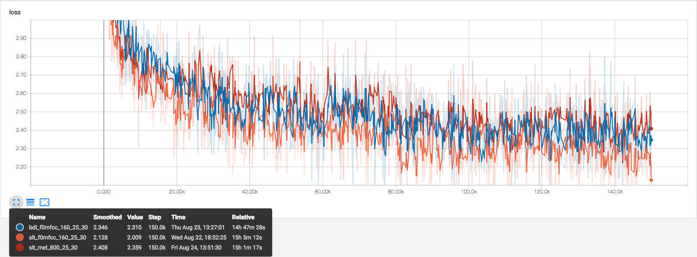

# Replicated "FFTNET: A Real-Time Speaker-Dependent Neural Vocoder"

## Pre-Process

To preprocess wav data and save as npz files. During the training, we use the preprocessed npz files as training data.

```
python -m fftnet.dataset \
    --source_wav_dir=/path/to/dir/of/waves \
    --result_npz_dir=/path/to/dir/for/preprocessed/results \
    --feature_name=mel \
    --feature_bins=25 \
    --fft_window_size=400 \
    --fft_hop_length=160
```

- **source_wav_dir** : path to a directory which contains wave files.
- **result_npz_dir** : path to a directory to keep all preprocessed data.
- **feature_name** : feature name for pre-processing.
    * f0mfcc: f0 (1 bins) + mfcc (feature_bins - 1 bins).
    * mfcc: mfcc by librosa.
    * mel: mel spectrogram by librosa.
- **feature_bins** : number of bins of the selected feature (feature size).
- **fft_window_size** : window size for fft (default is 400 as the paper).
- **fft_hop_length** : hop length for fft (default is 160 as the paper).

## Train

Train a model with pre-processed data.

```
python -m fftnet.experiment_train \
    --learning_rate=$(LEARNING_RATE) \
    --train_dir_path=$(TRAINING_DATA_PATH) \
    --ckpt_path=$(TRAINING_CKPT_PATH) \
    --logs_path=$(TRAINING_LOGS_PATH) \
    --batches_size=$(BATCH_SIZE) \
    --samples_size=$(SAMPLES_SIZE) \
    --max_training_step=$(TRAINING_STEP_MAX) \
    --num_quantization_levels=$(QUANTIZATION_LEVELS) \
    --num_layers=$(NUM_LAYERS) \
    --condition_size=$(CONDITION_SIZE) \
    --condition_scale=$(CONDITION_SCALE)
```

- **learning_rate** : initial learning rate of the model.
- **train_dir_path** : path to the directory which contains all the pro-processed data.
- **ckpt_path** : path to the directory for keeping the checkpoint.
- **logs_path** : path to the directory for keeping log.
- **batches_size** : size of each training batch.
- **samples_size** : number of samples for each training clip (for each iteration, use batches_size clips. each clip contains random cropped sample_size samples).
- **max_training_step** : stop training at certain step (100k is sufficient).
- **num_quantization_levels** : quantization levels for mu-law (256 in all my experiments).
- **num_layers** : number of fft layers.
- **condition_size** : size of local condition.
- **condition_scale** : scaling factor for local condition (scaled before feeding to the network to speed up training, sort of feature normalization).

## Decode

Decode wave features (e.g. mel) back to waves. Frequency domain to time domain. This experiment first encode the selected wave and features, then decode it back with the selected checkpoint.

On my machine, performance of numpy decoding is about 18 seconds / 16k samples.

Tensorflow is about the same performance (freeze model may improve it).

```
python -m fftnet.experiment_decode \
    --ckpt_path=$(TEST_CKPT_PATH) \
    --source_wave_path=/home/ironhead/datasets/cmu_arctic/cmu_us_$(TEST_DATA_NAME)_arctic/wav/$(TEST_SOURCE_WAVE_NAME) \
    --result_wave_path=$(TEST_RESULT_WAVE_PATH) \
    --feature_name=$(FEATURE_NAME) \
    --num_quantization_levels=$(QUANTIZATION_LEVELS) \
    --condition_size=$(CONDITION_SIZE) \
    --condition_scale=$(CONDITION_SCALE) \
    --num_layers=$(NUM_LAYERS) \
    --fft_window_size=$(FFT_WINDOW_SIZE) \
    --fft_hop_length=$(FFT_HOP_LENGTH) \
    --use_cpu
```

- **ckpt_path** : path to the checkpoint or the directory which contains the checkpoint.
- **source_wave_path** : path to a wave for the experiment.
- **result_wave_path** : path to write the decoded wave.
- **feature_name** : feature name for extracting features from the selected wave (f0mfcc/mfcc/mel).
- **num_quantization_levels** : quantization levels for mu-law (256 in all my experiments).
- **condition_size** : size of local condition.
- **condition_scale** : scaling factor for local condition (scaled before feeding to the network to speed up training, sort of feature normalization).
- **num_layers** : number of fft layers.
- **fft_window_size** : window size for fft (default is 400 as the paper).
- **fft_hop_length** : hop length for fft (default is 160 as the paper).
- **use_cpu** : use numpy to do the decoding (instead of tensorflow).

## Result

### Loss



### Experiment 0

- 16k Hz
- mel (25)
- fft window size: 400
- fft hop length: 160

| test data \ training data | awb | slt |
|---------------------------|-----|-----|
| awb                       | [wav](../assets/fftnet_awb_to_awb_mel_160_150000_arctic_b0539.wav) | [wav](../assets/fftnet_slt_to_awb_mel_160_150000_arctic_b0539.wav) |
| slt                       | [wav](../assets/fftnet_awb_to_slt_mel_160_150000_arctic_b0539.wav) | [wav](../assets/fftnet_slt_to_slt_mel_160_150000_arctic_b0539.wav) |


### Experiment 1

- 16k Hz
- arctic_b0539
- f0 (1) + mfcc (24)
- fft window size: 400
- fft hop length: 160

| test data \ training data | bdl | slt |
|---------------------------|-----|-----|
| bdl                       | [wav](../assets/fftnet_bdl_to_bdl_f0mfcc_160_150000_arctic_b0539.wav) | [wav](../assets/fftnet_slt_to_bdl_f0mfcc_160_150000_arctic_b0539.wav) |
| slt                       | [wav](../assets/fftnet_bdl_to_slt_f0mfcc_160_150000_arctic_b0539.wav) | [wav](../assets/fftnet_slt_to_slt_f0mfcc_160_150000_arctic_b0539.wav) |

### Experiment 2

- 16k Hz
- arctic_b0539
- mel (25)
- fft window size: 800
- fft hop length: 1040

| test data \ training data | slt |
|---------------------------|-----|
| bdl                       | [wav](../assets/fftnet_slt_to_bdl_mel_800_150000_arctic_b0539.wav) |
| slt                       | [wav](../assets/fftnet_slt_to_slt_mel_800_150000_arctic_b0539.wav) |

## Note

* Although the paper use conv1x1 for each FFT layer, it's actually dense layer.
* The fft layer are composed with 5 dense layers. 2 for input samples, 2 for conditions and 1 for mixed result. However, if the input samples and conditions are concatenated, the 4 dense layers can be merged into 1.

## Todo

- [ ] realtime decoder
- [ ] global condition
- [ ] no condition
- [ ] post-synthesis de-noising
